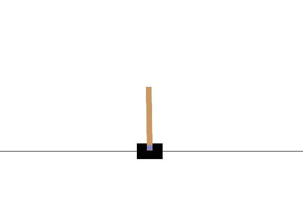

# 🧠 Reinforcement Learning: CartPole PPO Agent

<p align="center">
  
</p>

This project demonstrates **Reinforcement Learning for gaming applications** using the classic **CartPole-v1** environment from Gymnasium. A PPO (Proximal Policy Optimization) agent is trained to balance a pole on a moving cart using the Stable-Baselines3 library.

---

## ✅ Features

- Trains a PPO agent on the CartPole game
- Generates a training performance plot (`training_plot.png`)
- Produces a gameplay GIF of the trained agent (`cartpole_demo.gif`)
- Includes complete training + evaluation scripts
- Simple and beginner-friendly implementation

---

## ✅ Files in This Repository

| File / Folder | Description |
|--------------|-------------|
| `train_cartpole.py` | Trains PPO on CartPole for 20k timesteps |
| `watch_cartpole.py` | Loads model and records gameplay GIF |
| `training_plot.png` | Plot of evaluation rewards after training |
| `cartpole_demo.gif` | Demonstration of the trained agent |
| `models/ppo_cartpole.zip` | Trained PPO model (optional) |
| `requirements.txt` | Dependencies list |

---

## ✅ About the Environment: CartPole-v1

The **game** involves balancing a pole on a moving cart:

- **State:**
  - Cart position  
  - Cart velocity  
  - Pole angle  
  - Pole angular velocity  
- **Actions:**
  - `0` = Move Left  
  - `1` = Move Right  
- **Reward:** +1 for every timestep the pole stays upright  

The episode ends when the pole falls or the cart moves out of bounds.

---

## ✅ Algorithm Used: PPO (Proximal Policy Optimization)

PPO is a stable and efficient policy-gradient RL algorithm widely used in:

- Game AI  
- Robotics  
- Control systems  

The agent learns **through trial and error**, maximizing expected future reward.

---

## ✅ Installation & Setup

### 1️⃣ Create and activate a virtual environment (Windows CMD)

```

python -m venv .venv
.\.venv\Scripts\activate.bat

```

### 2️⃣ Install dependencies

```

pip install -r requirements.txt

```

---

## ✅ Training

Run:

```

python train_cartpole.py

```

This will:

- Train the agent  
- Save the PPO model to `models/`  
- Generate `training_plot.png`

---

## ✅ Generating the Gameplay GIF

After training:

```

python watch_cartpole.py

```

This saves a gameplay GIF as:

```

cartpole_demo.gif

```

---

## ✅ Results

- The agent learns to balance the pole for **150–200+ steps** after ~20k training timesteps.  
- The final GIF and plot show stable performance.

---

## ✅ Summary

This repository demonstrates a full **reinforcement learning pipeline**:

- Environment setup ✅  
- PPO training ✅  
- Model saving ✅  
- Evaluation ✅  
- Visualization ✅  
- Gameplay recording ✅  

A clean example of RL used in **gaming and control applications**.

---

## ✅ Author

**Mri**

Feel free to fork or extend this project!
```


